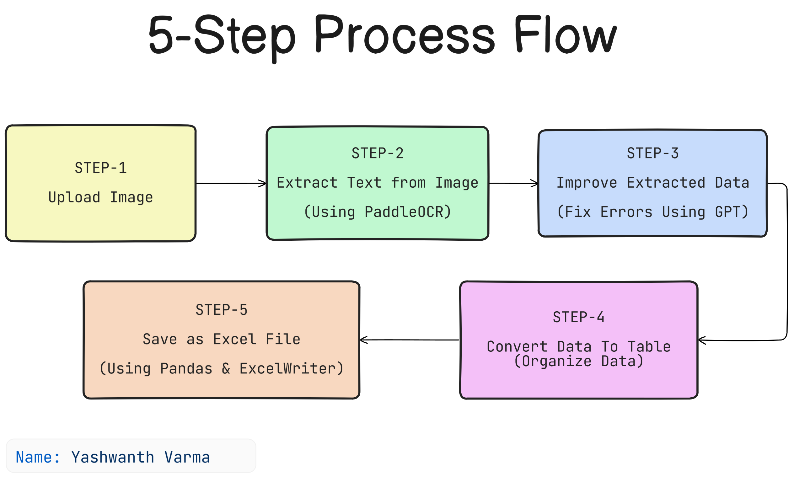

# Table OCR Data Extractor

A powerful Python utility that extracts tabular data from images using PaddleOCR and refines it with OpenAI's GPT model to produce accurate, structured Excel files.

## Features

- **Image-to-Table Conversion**: Extracts tabular data from images using advanced OCR technology
- **AI-Powered Refinement**: Uses OpenAI's GPT-4o model to clean, fix, and structure the extracted data
- **Multi-Language Support**: Compatible with multiple languages through PaddleOCR (English, Chinese, Japanese, Korean, etc.)
- **Excel Export**: Generates well-formatted Excel files with automatic column width adjustment
- **Robust Error Handling**: Includes fallback mechanisms for reliable operation
- **Customizable Processing**: Adjustable parameters for different image types and table structures


## Requirements

- Python 3.8 or higher
- OpenAI API key (Azure OpenAI deployment)
- Required Python packages:
    - paddleocr
    - openai
    - pandas
    - python-dotenv
    - xlsxwriter (optional, for enhanced Excel formatting)


## Installation

1. Clone this repository:

```bash
git clone https://github.com/yourusername/table-ocr-extractor.git
cd path/to/BATTON

```

2. Create a virtual environment (recommended):

```bash
python -m venv venv
source venv/bin/activate  # On Windows, use: venv\Scripts\activate
```

3. Install the required packages:

```bash
pip install paddleocr openai pandas python-dotenv xlsxwriter
```

4. Create a `.env` file in the project root directory with your OpenAI API key:

```
OPENAI_API_KEY=your_openai_api_key_here
```


> You can obtain an OpenAI API key from the Azure OpenAI service. For potential free usage options, check: https://github.com/marketplace/models/azure-openai/gpt-4o/playground/code

## Usage

1. Place your table image in the project directory (or specify a path to it)
2. Update the image path in the script (if different from "table3.jpg"):

```python
image_path = "path/to/your/table/image.jpg"
```

3. Run the script:

```bash
python table.py
```
### Required Packages
- `pip install paddleocr`
- `pip install openai`
- `pip install python-dotenv`
- `pip install pandas`
- `pip install xlsxwriter`   # Optional: for advanced Excel formatting
- `pip install openpyxl`     # Optional: fallback for Excel saving if xlsxwriter isn't available


4. The extracted table will be saved as "output_table.xlsx" in the current directory

## Customization

### OCR Language

You can change the OCR language by modifying the `lang` parameter in the `PaddleOCR` initialization:

```python
ocr = PaddleOCR(lang='en', use_angle_cls=True, show_log=False)
```

Supported languages include:

- 'ch' (Chinese Simplified)
- 'en' (English)
- 'korean' (Korean)
- 'japan' (Japanese)
- 'chinese_cht' (Chinese Traditional)
- 'ta' (Tamil)
- 'te' (Telugu)
- 'ka' (Kannada)
- 'latin' (Latin-based languages)
- 'arabic' (Arabic)
- 'cyrillic' (Cyrillic-based languages)
- 'devanagari' (Devanagari script)


### Row Detection Sensitivity

Adjust the `y_threshold` parameter to fine-tune how rows are detected:

```python
y_threshold = 20  # Increase for more tolerance in row detection
```


## How It Works

1. **OCR Processing**: The image is processed using PaddleOCR to extract text elements and their positions
2. **Table Structure Detection**: Text elements are grouped into rows and columns based on their spatial coordinates
3. **AI Refinement**: The extracted table is sent to OpenAI's GPT model to fix inconsistencies and structure the data properly
4. **Excel Generation**: The refined data is converted to a pandas DataFrame and exported as an Excel file with formatting



## Preview

For a working demonstration and visual guide, please visit: [Table OCR Extractor Demo](https://drive.google.com/file/d/1SWRqoYMH6LtxQ3r6LW9B6HudcCoyvIh7/view?usp=sharing)

## Troubleshooting

- **OCR Quality Issues**: Try adjusting the image quality or changing the OCR language
- **Row Detection Problems**: Modify the `y_threshold` parameter to better match your table's layout
- **API Errors**: Ensure your OpenAI API key is correct and has sufficient quota
- **Excel Export Issues**: Install xlsxwriter for better formatting, or the script will fall back to openpyxl
